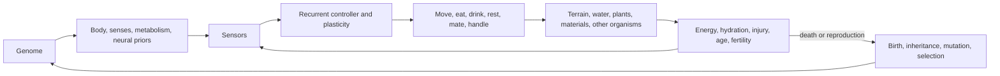

# The Worm World: Development Plan

## 1. Mission and definition of success

The Worm World is a persistent artificial-life environment. Worm-like organisms must maintain a physical body, manage energy and water, adapt behaviour during life, reproduce, and pass heritable traits to descendants. The platform will be used to investigate how ecological pressure, lifetime learning, and inheritance interact.

This is an experimental simulation, not a claim of biological realism or guaranteed intelligence. Tool use, complex cooperation, and distinct species are possible outcomes, not features that may be scripted into existence.

The first credible outcome is: **multiple worm lineages evolve different survival/foraging strategies, while learning-capable individuals adapt better than matched non-learning controls in previously unseen worlds.**

## 2. Non-negotiable design principles

1. **Only survival and reproduction select genes.** The simulation uses no designer fitness score such as food collected, distance travelled, or tools made.
2. **Homeostasis is not a task reward.** Organisms receive raw interoceptive signals. An optional reinforcement/plasticity signal may only be derived from their changing internal condition and must be genetically parameterized and logged.
3. **Lifetime learning is reset at birth.** A genome supplies morphology, brain parameters, priors, and learning rules. Learned weights and recurrent state reset unless an explicit research condition says otherwise.
4. **Everything important is replayable.** Identical code, dependency lock, config, and seed must yield the same event stream.
5. **Headless first, 3D second.** Rendering is a diagnostic and presentation layer, never a dependency for training.
6. **Novelty requires evidence.** All claims need independent seeds, baselines, held-out procedural worlds, and an ablation.

## 3. Product architecture

### 3.1 Modules

| Module | Responsibilities | Key outputs |
| --- | --- | --- |
| Simulation core | Fixed time, terrain, fields, spatial index, collision, events | deterministic world state and event log |
| Organism model | Segmented body, metabolism, sensors, action execution | physiology and action outcomes |
| Genetics | genome schema, recombination, mutation, compatibility, ancestry | offspring genotype and lineage record |
| Controller | recurrent policy state and local synaptic plasticity | action distribution and diagnostics |
| Experiment system | configurations, seeds, runner, artifact manifest, statistics | reproducible comparisons |
| Replay/viewer | snapshot/event playback, overlays, inspection | read-only visual evidence |

### 3.2 Recommended stack

- **Initial simulation:** Python 3.12, NumPy plus Numba where measurement proves it helps; fixed timestep; structure-of-arrays storage.
- **ML:** PyTorch. Add a small PettingZoo-compatible parallel-environment adapter and use TorchRL for comparison harnesses, recurrent-policy experiments, and data collection—not as a substitute for the custom organism model.
- **Data:** Parquet event data, DuckDB analysis, TensorBoard scalar logs, versioned YAML configurations.
- **Quality:** `uv`, `pytest`, Ruff, Pyright, pre-commit, GitHub Actions or equivalent CI.
- **Visualisation:** a separate Three.js/web replay viewer after the headless core is reliable.
- **Scale path:** profile, then port a measured hot loop to Rust/C++ or GPU batching. Use a Linux NVIDIA GPU worker for larger training runs. Detailed articulated locomotion can be explored in a separate MuJoCo lab, not imposed on the initial world.

### 3.3 Prebuilt versus custom decision

| Need | Use |
| --- | --- |
| Ecosystem, resource fields, body model, heredity, reproduction, materials, experiments | Custom code |
| Tensor operations, neural layers, profiling, test framework, data storage | Mature libraries |
| Multi-agent API compatibility | PettingZoo-style adapter |
| RL experiments and recurrent-policy utilities | TorchRL/PyTorch |
| Detailed contact locomotion research | Optional MuJoCo sidecar |
| 3D presentation | Separate custom viewer or later game-engine front end |

## 4. Simulation design

### 4.1 World

Begin with a continuous 2.5D world: XY movement with terrain height and depth, not full volumetric fluid simulation. It contains terrain, shallow/deep water, soil/nutrients, edible plants, decay, day/night, and periodic climate variation. Water begins as a field with immersion and drag; do not implement Navier–Stokes.

Plants require light, water, and local nutrients. Food and water must not respawn from arbitrary timers. Energy, mass, and entity transitions are recorded and tested within documented numerical tolerances.

### 4.2 Organisms

The baseline organism is a short chain of physical segments. Genome-controlled traits initially include segment count, segment radius, muscle force, body density, surface drag, mouth/grasp size, metabolic rates, damage tolerance, fertility threshold, sensory range/resolution, brain width, and plasticity coefficients.

Raw sensors are deliberately weak: nearby chemical/food/water gradients, local light, touch/contact, simple odour trails, and interoception (energy, hydration, injury, temperature, age, fertility). Early actions are segment contractions, turn bias, eat/drink, rest, mate, and later general handling/attachment.

### 4.3 Evolution

Use a persistent population rather than clean generations. Organisms age, die, mate when compatible, and produce offspring. Reproduction creates recombined, mutated genomes with deterministic lineage IDs. Survival is limited by resources and physical state; only actual descendants affect selection.

Species are inferred later using genotype clusters, ancestry, reproductive compatibility, morphology, diet, and habitat. They must never appear as hard-coded agent classes.

### 4.4 Reinforcement learning without designer lessons

Start with a small recurrent controller and local three-factor plasticity:

`Δw = learning_rate(genome) × neuromodulator(internal change) × eligibility_trace(pre, post)`

The genome defines initial weights, learning rates, trace decay, and how internal signals modulate plasticity. An offspring receives those inherited values but a clean lifetime state. This lets evolution select useful learning biases while preventing a global trainer from teaching a single desired policy.

Run ordinary PPO/TorchRL only as a diagnostic baseline in a controlled laboratory environment; it is not the population's production brain. Maintain strict experiments with learning disabled and with evolutionary change disabled.

### 4.5 Materials and possible tools

Introduce only general materials: stones, sticks, fibres, mud, carcasses. Each has physical properties such as mass, friction, shape, buoyancy, rigidity, breakage, and attachability. Organisms may push, carry, pull, wedge, pile, or attach. Do not add recipes, named tools, or rewards for construction.

Any claimed material innovation needs a counterfactual: replay comparable conditions with the object absent or moved, then demonstrate a survival/reproductive difference over multiple seeds.

## 5. Phased delivery plan

### Phase 0 — specification and bootstrap

**Build:** repository scaffold, package management, test/lint/type checks, configuration schema, seeded random stream service, event/log schemas, benchmark harness, and state-handoff document.

**Acceptance:** CI passes; a no-op world run creates a manifest containing code revision, dependency lock, config, seed, and deterministic event hash.

### Phase 1 — single-organism survival sandbox

**Build:** fixed-timestep world; one worm body; energy/hydration/injury; simple food/water fields; minimal senses and actions; death; replay.

**Acceptance:** identical replay from identical inputs; conservation/lifecycle tests pass; changing action sequences causes predictable movement, eating, drinking, and death.

### Phase 2 — persistent population and evolution

**Build:** population manager, births/deaths, sexual and configurable asexual reproduction, mutation/recombination, compatibility, lineage storage, spatial competition, and diversity reports.

**Acceptance:** across independent seeds, inherited traits produce measurable survival/descendant differences; controls confirm that removing heritability removes the trend.

### Phase 3 — lifetime learning

**Build:** recurrent controller, local plasticity, genome encoding of brain/plasticity parameters, learning diagnostics, and learning-on/off experiment suite.

**Acceptance:** learning-capable populations outperform matched non-learning populations in held-out world distributions without direct task rewards; reported confidence intervals and replays are saved.

### Phase 4 — ecology and divergence

**Build:** plant dynamics, decay/scavenging, seasonal scarcity, richer terrain, predator/prey pressure only after herbivore stability, mate choice, and analytic lineage/speciation views.

**Acceptance:** viable populations persist across climate/resource seeds; diversity and niche measures remain above predeclared thresholds without manual species assignments.

### Phase 5 — materials and construction

**Build:** movable material entities, reliable physical affordances, general manipulation, attachment, and causal material-use evaluation.

**Acceptance:** any material strategy reported as adaptive survives counterfactual and ablation experiments. Absence of tool use is an acceptable result.

### Phase 6 — embodied 3D

**Build:** 3D terrain/water volumes, richer body contact/movement, high-fidelity replay, and optional MuJoCo morphology testbed.

**Acceptance:** the 3D layer does not change verified headless behaviour unexpectedly; performance and deterministic replay budgets are documented.

### Phase 7 — research workbench

**Build:** experiment registry, run comparison dashboard, lineage browser, replay export, automatic statistical reports, and release documentation.

**Acceptance:** a third party can reproduce a result from a saved manifest without access to the original interactive session.

## 6. Experiments and metrics

No single reward score represents progress. Track:

- Median and distributional lifespan, biomass, and viable population count.
- Reproductive success and descendant survival by lineage.
- Genetic diversity, morphology diversity, compatibility graph structure, and ecological niche separation.
- Learning benefit: matched learning-on/off and evolution-on/off comparisons.
- Resource and energy flows, extinction rate, and population stability.
- Behavioural novelty, recorded separately from evidence that novelty is adaptive.

Every experiment saves its exact configuration, seed list, code revision, dependency lock, hardware summary, raw events, aggregate metrics, and replay snippets. Test on held-out seeds/world distributions; never tune exclusively against the reporting set.

## 7. AI coding-agent programme

Use one integration owner and bounded component tickets. Agents work in isolated worktrees/branches and do not edit the same core module concurrently.

| Role | Scope | Required completion evidence |
| --- | --- | --- |
| Integration owner | interfaces, merges, phase gates, releases | full checks and updated handoff state |
| World agent | terrain, fields, spatial queries, lifecycle events | determinism and conservation tests |
| Organism agent | body, physiology, sensors, action execution | behavioural fixture and unit tests |
| Genetics agent | genome, mutation, recombination, lineage | inheritance/reproducibility tests |
| Learning agent | controller, plasticity, ablations | held-out experiment runner |
| Science/QA agent | invariants, statistics, experiment validity | reports and regression tests |
| Viewer agent | replay and inspection only | read-only playback test |

Every ticket must state its phase, input/output interfaces, invariants, config additions, tests, benchmark effect, and exact artifact outputs. The integration owner updates `PROJECT_STATE.md` after each completed ticket.

## 8. Risks and controls

| Risk | Control |
| --- | --- |
| Simulation too slow | headless 2.5D design, profile first, batch/port only measured hot paths |
| Reward hacking / hidden teaching | raw homeostatic signals, configuration review, reward audit tests |
| Evolution collapses to one clone | environmental variation, spatial structure, diversity measurement; report failure honestly |
| Irreproducible results | deterministic streams, manifests, replay hashes, CI fixtures |
| Overclaiming emergence | controls, multiple seeds, counterfactual material tests, preregistered metrics where practical |
| 3D consumes the project | phase gate: no 3D work before ecological and learning evidence exists |

## 9. Initial ticket queue

1. Create the Python project scaffold, `uv` configuration, test/lint/type-check commands, and CI.
2. Implement typed experiment and world configuration plus deterministic named RNG streams.
3. Define versioned event, replay-manifest, and snapshot schemas.
4. Implement a no-op fixed-timestep world with a deterministic replay hash.
5. Add the first benchmark and Phase 0 acceptance test.

Do these in order. On completion of each ticket, update `docs/PROJECT_STATE.md` rather than starting a new phase.
